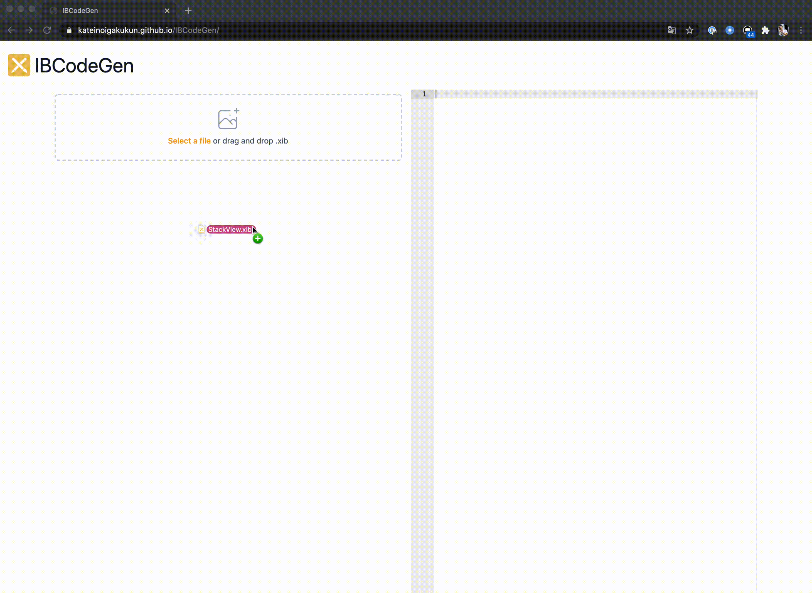

# IBCodeGen

A tool to transition from Interface Builder to Swift code.



## Usage

Please visit: https://kateinoigakukun.github.io/IBCodeGen


## CLI

### Installation

```
$ mint install kateinoigakukun/IBCodeGen@main
# or
$ swift build -c release && cp .build/release/ibcodegen /usr/local/bin/
```
